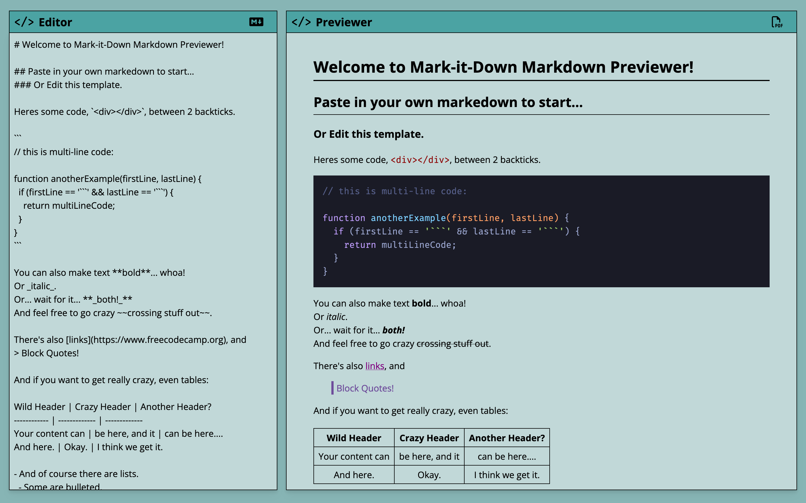

# Mark-It-Down markdown editor

Mark-It-Down allows you to write/edit and preview markdown in real time. You can also download your content as markdown file or beautifully formated pdf. A default markdown syntax guide is preloaded into the editor for your reference, so you can start typing in your content right away. Or you can paste in your own content, and start editing from there.

### Next Feature To Add

- Upload markdown file to edit, instead of having to paste the content in the editor.
- Offer more pdf formating options.

- [About](#about)
  - [Features](#features)
  - [Links](#links)
  - [Screenshots](#screenshots)
  - [Built With](#built-with)
- [Author](#author)

## About

### Features

- Responsive layout, delivering a concise and slick look on both Mobile and Desktop
- Freely adjustable editor size let you edit your markdown comfortably on any screen.

### Links

- Live Site URL: [Github page](https://llhyuan.github.io/markdown-previewer/)

### Screenshots

### Built with

- React 
- Tailwind Css
- Css variables
- Flexbox
- Mobile-first workflow
- [React](https://reactjs.org/) - JS library

## Author

- LinkedIn - [Hangyuan Liu](www.linkedin.com/in/hangyuan-liu-a9282718b)
- Frontend Mentor - [@llhyuan](https://www.frontendmentor.io/profile/llhyuan)
